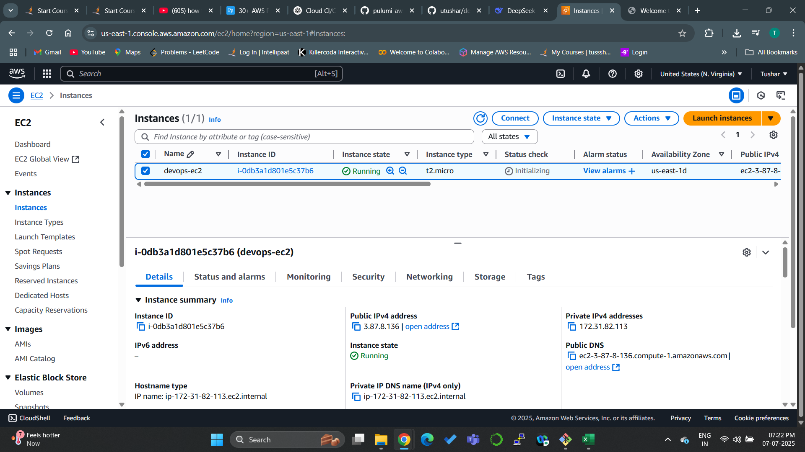
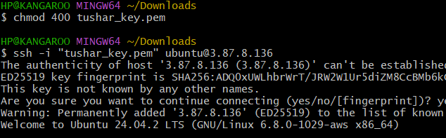
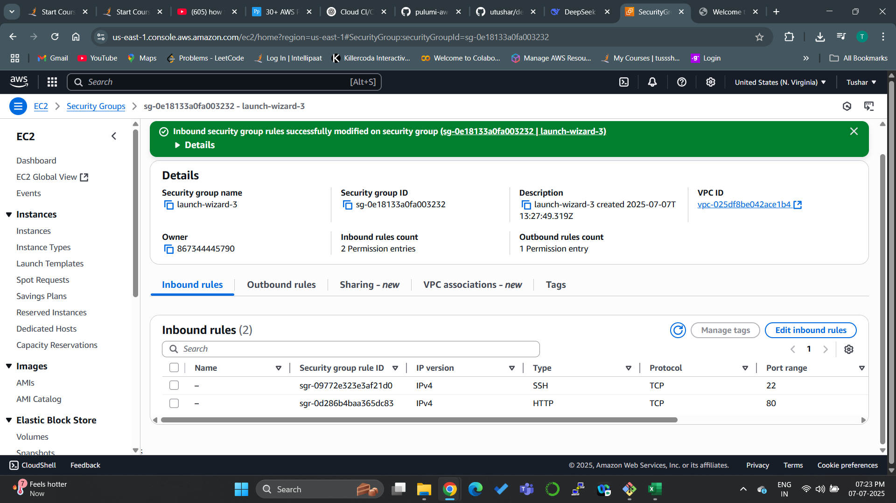
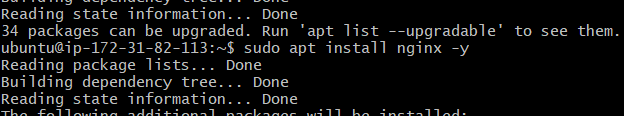
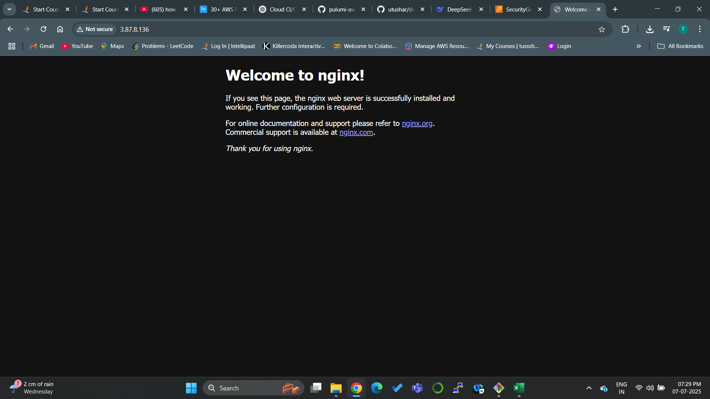

\# 🚀 Day 2 – EC2 + NGINX Setup


📅 \*\*Date:\*\* 7 July 2025


---


\## ✅ What I Did:

\- Launched an Ubuntu EC2 instance using AWS Free Tier

\- Created and used a Key Pair for SSH login

\- Updated the Security Group to allow:

&nbsp; - Port 22 (SSH)

&nbsp; - Port 80 (HTTP)

\- Connected to the server using SSH from Git Bash

\- Installed NGINX using `apt`

\- Verified the "Welcome to NGINX" page by visiting public IP in browser


---


\## 💻 Key Commands Used:


```bash

\# SSH into server

ssh -i "tushar-key.pem" ubuntu@<your-public-ip>


\# Install NGINX

sudo apt update

sudo apt install nginx -y


\# Check status

sudo systemctl status nginx


## 📸 Screenshots

1. EC2 Instance Running  
   

2. Key pair used  
   

3. SSH Connection  
   

4. NGINX Installed  
   

5. NGINX Welcome Page  
   


